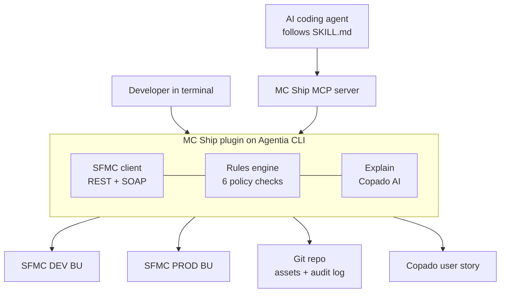

# MC Ship

**Git-based, policy-checked Salesforce Marketing Cloud releases, built on Copado Agentia CLI.**

Marketing Cloud teams still move Data Extensions and Content Builder emails between Business Units by hand. There is no diff, no review and no audit trail, and mistakes such as a broken `Lookup` or a missing unsubscribe link only show up after a send.

MC Ship brings Marketing Cloud into the same terminal-first DevOps flow as core Salesforce, through all three Agentia extension points:

| Extension point | What MC Ship adds |
| --- | --- |
| **Commands** | An Agentia plugin with `agentia mc connect / pull / diff / check / explain / deploy` |
| **Skills** | `skills/mc-ship/SKILL.md`, so any coding agent runs the release in the right order and stops for approval |
| **MCP** | `mcp-server/`, six MCP tools for Cursor, VS Code or Claude |

It links to Copado through the CLI: `mc explain` uses the Copado AI release agent (`agentia ai agent ask --agent release`), and releases are attached to a Copado user story (`agentia cicd work update`).



## Quick start (5 minutes, no Marketing Cloud account needed)

```bash
# 1. Agentia CLI (beta)
npm install -g @copado/agentia-cli

# 2. MC Ship plugin
git clone https://github.com/mcshipdev-design/mc-ship && cd mc-ship/plugin
npm install && npm run build && agentia plugins link .

# 3. Demo project with two mock BUs (DEV, PROD), pulled into Git
cd .. && bash demo/reset.sh /tmp/mc-ship-demo && cd /tmp/mc-ship-demo

agentia mc diff DEV PROD        # 4 changes
agentia mc check DEV PROD       # FAIL: 4 blocking issues, 2 warnings
agentia mc explain DEV PROD     # plain-English risk note
agentia mc deploy DEV PROD      # blocked

node <path-to>/mc-ship/demo/apply-fixes.mjs    # or fix the files by hand
agentia mc check DEV PROD       # PASS
agentia mc deploy DEV PROD      # deployed, audit log written
```

## Connect a real Business Unit

Create an **installed package** in Marketing Cloud with a server-to-server API integration and these scopes: Data Extensions read/write, Saved Content read/write (Content Builder), and Email read.

```bash
MCSHIP_CLIENT_SECRET='<secret>' agentia mc connect DEV \
  --subdomain <tenant-subdomain> --account-id <DEV MID> --client-id <client id>
```

- The secret is stored in `~/.mcship/credentials.json` (mode 600), never in the project. In CI, set `MCSHIP_SECRET_<BU>` instead.
- `.mcship/config.json` (BU names, subdomain, MID, client ID) is safe to commit.

## Commands

| Command | What it does |
| --- | --- |
| `agentia mc connect <BU>` | Connect a BU (live installed package, or `--mock` JSON for demos and CI) |
| `agentia mc pull --bu <BU>...` | Export DE schemas (+ row counts) and Content Builder emails, blocks, templates into `mc/<BU>/` |
| `agentia mc diff <from> <to>` | Added / changed / removed assets with field-level detail |
| `agentia mc check <from> <to>` | Six policy rules; exit code 1 on fail, so it can gate CI |
| `agentia mc explain <from> <to>` | Plain-English risk summary and release note (Copado AI, offline fallback); `--user-story X --attach` |
| `agentia mc deploy <from> <to>` | Refresh target, re-check, block on fail, deploy, audit log, update user story; `--dry-run`, `--yes` |

Every command supports `--json`.

### The six checks

| Rule | Catches |
| --- | --- |
| `hardcoded-bu-values` | `ContentBlockById`, GUID DE keys, the source MID in content |
| `broken-de-reference` | AMPscript lookups to DEs or fields that won't exist in the target |
| `email-footer-compliance` | Emails (including their blocks) with no unsubscribe link or physical address |
| `pii-and-sendability` | Broken send relationship, email/phone typed as Text, sensitive fields with no retention |
| `missing-content-block` | `ContentBlockByKey` to a block not in the target or the release |
| `destructive-de-change` | Type, length or primary key changes on DEs that hold data |

Details and fixes: [skills/mc-ship/references/rules.md](skills/mc-ship/references/rules.md).

## Use it from an AI agent

**Skill.** Copy `skills/mc-ship` next to the Agentia skills:

```bash
cp -r skills/mc-ship .agents/skills/        # or .cursor/skills, .claude/skills
```

**MCP.** Add the server to your MCP client (e.g. `.cursor/mcp.json`), next to `agentia mcp start`:

```json
{
  "mcpServers": {
    "agentia": {"command": "agentia", "args": ["mcp", "start"]},
    "mc-ship": {
      "command": "node",
      "args": ["<path-to>/mc-ship/mcp-server/server.mjs"],
      "env": {"MCSHIP_PROJECT_DIR": "<path to your MC Ship project>"}
    }
  }
}
```

Tools: `mc_status`, `mc_pull`, `mc_diff`, `mc_check`, `mc_explain`, `mc_deploy`. `mc_deploy` is a dry run by default and refuses to deploy unless `confirm: true` is passed after a human approves the plan.

Then ask: *"Ship the spring promo email from DEV to PROD and link it to US-0001234."*

## Design notes

- **Git is the source of truth.** `mc/<source BU>/` holds what gets deployed. `mc/<target BU>/` mirrors the live target and is refreshed on every deploy.
- **Safe by default.** Deploy never deletes, never changes field types on DEs with data, refuses on failed checks, and logs every deploy (including forced ones) to `mc/audit.log.jsonl`.
- **Supported Agentia integration.** Plugins cannot call Agentia internals yet, so all Copado calls go through `agentia ... --json` in one file (`plugin/src/core/agentia.ts`).

## Repo layout

```
plugin/          Agentia CLI plugin (scaffolded with npm init @copado/agentia-plugin)
  src/commands/mc/   connect, pull, diff, check, explain, deploy
  src/core/          SFMC client (live + mock), AMPscript parser, rules, diff, explain
  test/              unit tests (node --test)
mcp-server/      MCP server exposing the commands as tools
skills/mc-ship/  SKILL.md + rules reference
sample-project/  seed data for the DEV and PROD mock BUs
demo/            reset.sh and apply-fixes.mjs for the demo
```

## Tests

```bash
cd plugin && npm test                                   # unit tests
cd mcp-server && npm install && MCSHIP_PROJECT_DIR=/tmp/mc-ship-demo npm test   # MCP end-to-end
```

## Status and limits

- Asset types: Data Extensions (schema) and Content Builder `htmlemail`, `htmlblock`, `template`. Automations and Journeys are next.
- The live client uses documented Marketing Cloud REST and SOAP APIs. The demo uses mock BUs so it is repeatable.
- Built on Agentia CLI `1.0.0-beta.2` (alpha preview): commands may change.

## Open-source components

`@oclif/core` (MIT), `@modelcontextprotocol/sdk` (MIT), `zod` (MIT), `typescript` (Apache-2.0), `oclif` (MIT), `shx` (MIT).

## License

MIT
